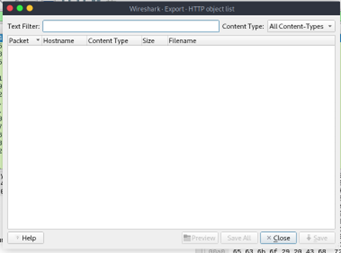
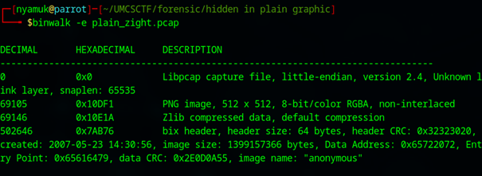
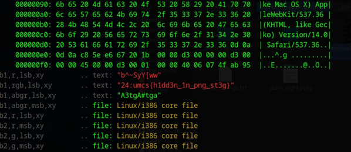

# UMCS CTF Preliminary 2025 Writeup - SpamBytes

Welcome to our writeup for the UMCS CTF Preliminary 2025!

## Table of Contents

### Forensic
1. [Hidden in Plain Graphic (Nyamuk)](#hidden-in-plain-graphic-nyamuk)

### Steganography
1. [Broken (Akmlaff)](#broken-akmlaff)
2. [Hotline Miami (Akmlaff)](#hotline-miami-akmlaff)

### Reverse Engineering
1. [Http-Server (Akmlaff)](#http-server-akmlaff)

### Cryptography
1. [Gist of Samuel (lkhwn.nzm & Akmlaff)](#gist-of-samuel-lkhwnnzm--akmlaff)

### Pwn
1. [babysc (lkhwn.nzm)](#babysc-lkhwnnzm)
2. [Liveleak (lkhwn.nzm)](#liveleak-lkhwnnzm)

### Web
1. [Healthcheck (lkhwn.nzm)](#healthcheck-lkhwnnzm)
2. [Straightforward (Nyamuk)](#straightforward-nyamuk)

## Forensic
### Hidden in Plain Graphic (Nyamuk)

### Description
> Agent Ali, who are secretly a spy from Malaysia has been communicate with others spy from all around the world using secret technique. Intelligence agencies have been monitoring his activities, but so far, no clear evidence of his communications has surfaced. Can you find any suspicious traffic in this file?

---

### Solution

First, I opened the packet capture to see what protocols were inside.  
Next, I filtered `http` protocol — maybe there were some files I could export.


Unfortunately, no downloadable files were available via `http`.



I found nothing.

Then, I tried looking for any hidden content inside the `.pcap` using `binwalk`:

```bash
binwalk -e plain_zight.pcap
```


From the scan, I saw that there was a PNG file detected at offset `0x10DF1` (in decimal is `69105`).

Then, I decided to manually extract it using `dd`:

```bash
dd if=plain_zight.pcap of=manual_extracted.png bs=1 skip=69105
```


The image was successfully extracted:


After extracting, I checked the file type using:

```bash
file manual_extracted.png
```


It confirmed that the image is a valid `PNG`, `512x512 RGBA` — likely suitable for steganalysis.

So, my assumption for png file, I can use `zsteg` or [aperisolve](https://www.aperisolve.com/).
Lastly, I ran `zsteg` to analyze the LSB (Least Significant Bit) layers:

```bash
zsteg manual_extracted.png
```



Flag: **umcs{h1dd3n_1n_png_st3g}**

## Steganography
### Broken (Akmlaff)

### Description
> Can you fix what’s broken ?

---

### Solution

We cant see the video because it is broken and after using `exiftool`, checked for its `hex` and everything was okay so I just thought that the `mp4` was really broken so.

