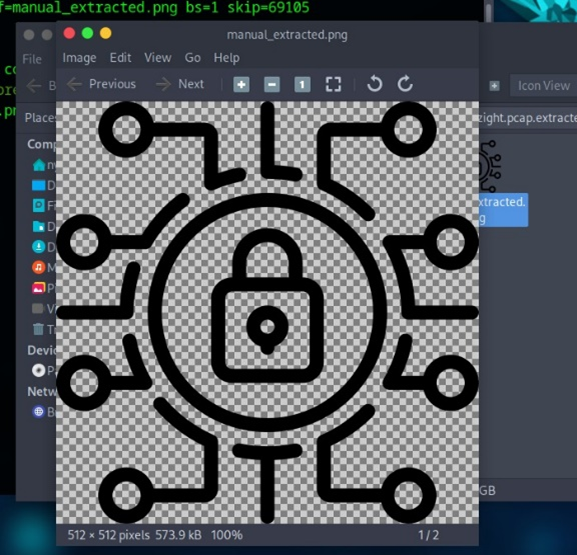
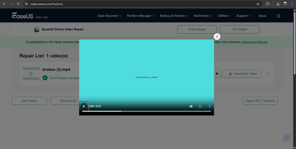
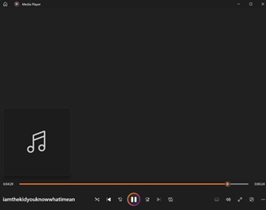
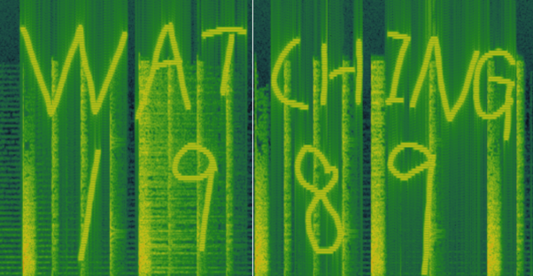
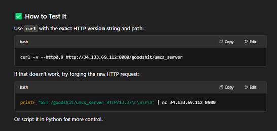
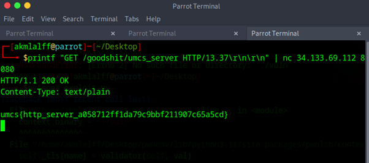

# UMCS CTF Preliminary 2025 Writeup - SpamBytes

Welcome to our writeup for the UMCS CTF Preliminary 2025!

## Table of Contents

### Forensic
1. [Hidden in Plain Graphic (Nyamuk)](#hidden-in-plain-graphic-nyamuk)

### Steganography
1. [Broken (Akmlaff)](#broken-akmlaff)
2. [Hotline Miami (Akmlaff)](#hotline-miami-akmlaff)

### Reverse Engineering
1. [Http-Server (Akmlaff)](#http-server-akmlaff)

### Cryptography
1. [Gist of Samuel (lkhwn.nzm & Akmlaff)](#gist-of-samuel-lkhwnnzm--akmlaff)

### Pwn
1. [babysc (lkhwn.nzm)](#babysc-lkhwnnzm)
2. [Liveleak (lkhwn.nzm)](#liveleak-lkhwnnzm)

### Web
1. [Healthcheck (lkhwn.nzm)](#healthcheck-lkhwnnzm)
2. [Straightforward (Nyamuk)](#straightforward-nyamuk)

## Forensic
### Hidden in Plain Graphic (Nyamuk)

### Description
> Agent Ali, who are secretly a spy from Malaysia has been communicate with others spy from all around the world using secret technique. Intelligence agencies have been monitoring his activities, but so far, no clear evidence of his communications has surfaced. Can you find any suspicious traffic in this file?

`plain_zight.pcap`

---

### Solution

First, I opened the packet capture to see what protocols were inside.  
Next, I filtered `http` protocol — maybe there were some files I could export.


Unfortunately, no downloadable files were available via `http`.


I found nothing.

Then, I tried looking for any hidden content inside the `.pcap` using `binwalk`:

```bash
binwalk -e plain_zight.pcap
```


From the scan, I saw that there was a PNG file detected at offset `0x10DF1` (in decimal is `69105`).

Then, I decided to manually extract it using `dd`:

```bash
dd if=plain_zight.pcap of=manual_extracted.png bs=1 skip=69105
```


The image was successfully extracted:



After extracting, I checked the file type using:

```bash
file manual_extracted.png
```


It confirmed that the image is a valid `PNG`, `512x512 RGBA` — likely suitable for steganalysis.

So, my assumption for png file, I can use `zsteg` or [aperisolve](https://www.aperisolve.com/).
Lastly, I ran `zsteg` to analyze the LSB (Least Significant Bit) layers:

```bash
zsteg manual_extracted.png
```


Flag: **umcs{h1dd3n_1n_png_st3g}**

## Steganography
### Broken (Akmlaff)

### Description
> Can you fix what’s broken ?

`Broken.mp4`

---

### Solution


We cant see the video because it is broken and after using `exiftool`, checked for its `hex` and everything was okay so I just thought that the `mp4` was really broken so.



I searched for an online `mp4` repair tool [EaseUS](https://repair.easeus.com/#upload) put the bad boy in to repair the broken file and boom ! we got the flag.

Flag: **umcs{h1dd3n_1n_fr4me}**

### Hotline Miami (Akmlaff)
### Description
**Challenge URL:** [Github - Hotline_Miami](https://github.com/umcybersec/umcs_preliminary/tree/main/stego-Hotline_Miami)

> You’ve intercepted a mysterious floppy disk labeled 50 BLESSINGS, left behind by a shadowy figure in a rooster mask. The disk contains a cryptic image and a garbled audio file. Rumor has it the message reveals the location of a hidden safehouse tied to the 1989 Miami incident. Decrypt the clues before the Russians trace your signal.

`iamthekidyouknowwhatimean.wav`,`requirement.txt`,`rooster.jpg`

---

### Solution

`requirement.txt`:


Saw this in the readme.txt and I was like this might be the format.

Flag format would be: **Subject_Be_Verb_Year**

`iamthekidyouknowwhatimean.wav`



The `.wav` file played a consistent beat. I loaded the audio into [Sonic Visualiser](https://www.audacityteam.org/), added a spectrogram layer and this appeared:



So, we got the last 2 parts of the flag which are **WATCHING** (verb) and **1989** (year).

Next, I used [aperisolve](https://www.aperisolve.com/) on `rooster.jpg`.


It’s a hot nugget and when I scrolled down until the end of the string I saw **Richard** and it was actually a character in hotline miami game. So, I think that’s the subject?


Then I was googling I saw this reddit post that says the game was just Richard watching a film and I also that he is connected to the 1989 killing on fandom so I think its making sense?

So, I put **the Subject_Be_Verb_Year** from the `requiement.txt` and all the hints I got **Watching** ,**1989** and **Richard**. Then... voila!!


Flag: **umcs{Richard_Is_Watching_1989}**

## Reverse Engineering

### Http-Server (Akmlaff)
### Description
> I created a http server during my free time
> 
> 34.133.69.112 port 8080

`server.unknown`

---

### Solution

We got a file named `server.unknown`.


Downloaded the file and checked for the file type and it was an `ELF` file so I put it into my bestfriend chatgpt instead of trying the **nc 34.133.69.112 8080**.



So uh… this wasn’t any interesting but after I having a very very deeptalk with my brother **chatpgt** and I used the
```bash
printf "GET /goodshit/umcs_server HTTP/13.37\r\n\r\n" | nc 34.133.69.112 8080
```
and… I don’t know if this was intended or not but… chatgpt was explaining the 500 error and it asked me to test forging the raw `HTTP` request and… I guess…



I got the flag...!! yay.

Flag: **umcs{http_server_a058712ff1da79c9c9bbf211907c65a5cd}**

## Cryptography

### Gist of Samuel (lkhwn.nzm & Akmlaff)
### Description
> Samuel is gatekeeping his favourite campsite. We found his note.
> 
> flag: umcs{the_name_of_the_campsite}
> 
> The flag is case insensitive

<details>
  <summary>Hint for 0 points</summary>
! This is not a real hint. ! I dont remember but, its a another gist hash of umcs
</details>

`gist_of_samuel.txt`

---

### Solution


We were given a file full of train emojis.

From the pattern, the blue train is always singular, so we instantly assume it was morse code since the spaces are required to separate the characters.


