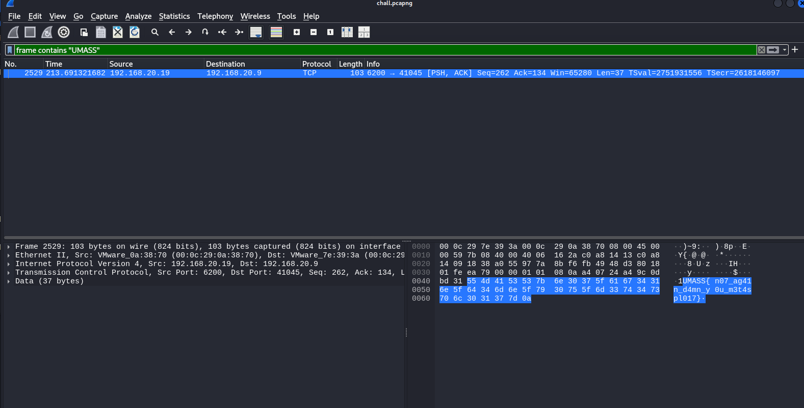

# Writeup UMassCTF 2025 (some Forensics and Misc) - NY4MUK

## Table of Contents

### Forensics
1. [No Updates](#no-updates)
2. [Macrotace](#macrotrace)

### Misc
1. [Odd One Out](#odd-one-out)
2. [Tower Signal](#tower-signal)

---

## Forensics
### No Updates

### Description
> I don't believe in updating my computer, it just takes so long! Besides, no one could ever hack me, I use good passwords!

[chall.pcapng](forensics/noupdates/chall.pcapng) 

---

### Solution

`chall.pcapng` overview:


We look through the traffic and see a lot of `DNS` and `TCP` packets. There’s no `HTTP`, so we know we’ll need to dig deeper, likely a raw `TCP` shell or reverse shell session.

After serveral minutes talking with my bestfriend. GPT gave me this filter command:

```bash
frame contains "flag"
```


Then, I tried to follow `TCP` stream. Maybe I can find something there?


Found it. 

So, basically, in most forensics challenges, the goal is usually to find a hidden flag inside provided files like **memory dumps**, **packet captures**, or **disk images**.

Often, you can get a quick lead just by searching for keywords like **flag** using tools like `grep` on the command line or applying a display filter in Wireshark (e.g., `frame contains "flag"`). It’s a simple but effective first step in narrowing down where the flag might be hidden.

Also I found out another solution lol. 

Another solution:

```bash
frame contains "UMASS"
```



Flag: **UMASS{n07_ag41n_d4mn_y0u_m3t4spl017}**

---

### Macrotrace
### Desciption
> A suspicious spreadsheet surfaced from the archive of a defunct Flash game studio. Opening it does... something, but whatever was there is now gone.
>
> Your mission: reverse the macro, trace what it did, and recover the flag it tried to destroy.
>
> Use `23ab3Y9/]jKl` as the password when extracting the password-protected zip archive.

[macrotrace-assets.zip](forensics/macrotrace/macrotrace-assets.zip)


